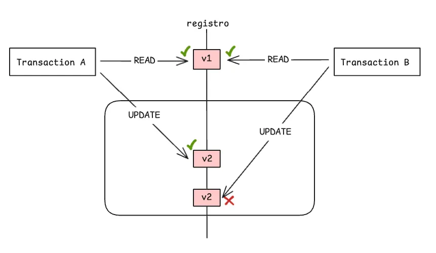
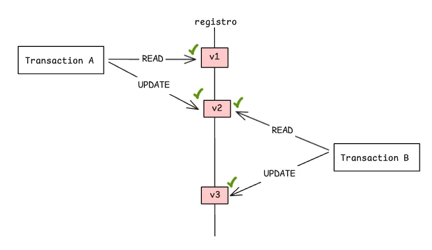


Diferente do que vimos no Lock Pessimista, o Lock Otimista assume que as concorrências são raras. Isso significa que raramente múltiplos usuários irão editar o mesmo registro ao mesmo tempo - essa colisão é na verdade uma exceção.  🚀



Importante entender também a estratégia de lock pessimista, que escrevemos [aqui](https://alineavila.dev/posts/pessimist-lock/) e analisar qual se encaixa melhor no seu problema.



## 🧩 Mas na prática qual a diferença entre o lock otimista e o pessimista?

Lembra que o lock pessimista cria um bloqueio no registro desde o inicio da transação até que ela finalize? Isso pode gerar alguns trade offs, como por exemplo o esgotamento do pool de conexões em que detalho abaixo.

### 🤯 Trade Off - Lock Pessimista (Disponibilidade das Conexões)

Agora vamos imaginar sua aplicação dentro de um pool de conexões no banco de dados.

- Transação A pega conexão C1 do pool, aplica lock pessimista (linha travada no BD).
- Transação B pede conexão C2 (outra do mesmo pool), mas o banco bloqueia a conexão C2 até a Transaçao A commitar – C2 fica **pendente** (esperando lock), **não liberada**.

Em cenários de alta concorrência, é crucial notar que a transação B permanece pendente. Em um sistema com milhões de transações, o pool de conexões pode ser esgotado, resultando em falhas na aplicação. A utilização de lock pessimista exige um ajuste criterioso do tamanho do pool e do timeout das conexões. No Spring, essa configuração é feita com o HikariCP, mas a escalabilidade requer muita atenção.


## 🔒 Lock Otimista

Por ooooutro ladooo o lock otimista não bloqueia o registro e o pool de conexões roda livre. O pulo do gato é que nesse cenário sua tabela agora tem uma nova coluna chamada version  e toda vez que uma transação de update começar essa coluna será incrementada. 

### Com Conflito

No diagrama abaixo, você pode ver o fluxo: as transações leem o registro com a versão ```v1```. Quando tentam atualizar, verificam se a versão ainda é a mesma. Se for, a alteração é aplicada e a versão é incrementada para ```v2```. Caso já tenha sido modificada, ocorre um conflito.



### Sem Conflito

Nesse fluxo sem conflito, a Transação A lê a versão ```v1``` e a atualiza para ```v2```. Em seguida, a Transação B lê a versão mais atualizada, ```v2```, e a atualiza para ```v3```, sem que ocorram problemas de concorrência.



## 🖥️ Show Me The Code 

Na prática, o update no lock otimista é executado com uma condição. A consulta SQL inclui uma cláusula ```WHERE``` que verifica se a coluna ```version``` do registro ainda é igual ao valor inicial lido. Se a condição for verdadeira, o registro é atualizado e o campo ```version``` é incrementado. Caso contrário, a operação é cancelada para garantir a integridade dos dados.

A query SQL seria mais ou menos assim: ```UPDATE nome_tabela``` seguida por ```SET coluna1 = valor1, coluna2 = valor2, version = version + 1```. E a condição crucial é adicionada com ```WHERE id = id_do_registro AND version = valor_versão_inicial```.

Note que o o valor ```valor_versão_inicial```  precisa ser utilizado na cláusula ``WHERE`` do ```UPDATE``` , ou seja, o fluxo envolve uma leitura daquele registro que você vai atualizar. 

Fazer essa implementação no nosso javinha é extremamente simples usando JPA, basta anotarmos o atributo de versão com ```@Version``` , como no exemplo abaixo:

```java
import jakarta.persistence.Entity;
import jakarta.persistence.Id;
import jakarta.persistence.Version;

@Entity
public class ContaBancaria {

    @Id
    private Long id;

    private Double saldo;

    // O JPA gerencia este campo automaticamente
    @Version
    private Integer versao;

    // Getters e Setters
}
```

Agora quando você chamar aquele repository para alterar um registro, o que acontece é que a entidade (nesse caso ```ContaBancaria```) já é carregada com a versao que veio do banco e o JPA manda um comando mais ou menos assim:

```sql
UPDATE conta_bancaria
SET saldo = 200.00, versao = 2
WHERE id = 1 AND versao = 1; -- A validação acontece aqui
```

Se outro usuário tiver alterado essa mesma conta e salvado antes de você, a versão no banco de dados já será **2**.

Quando o seu `UPDATE` tentar rodar com a cláusula `WHERE id = 1 AND versao = 1`, ele não encontrará nenhum registro para atualizar (afetará 0 linhas), pois o registro atual tem `versao = 2`  e é aqui que nasce a exceção **`jakarta.persistence.OptimisticLockException` .**

### 🤯 Trade Off - Lock Otimista (Disponibilidade das Conexões) 
- Exemplo 1:

Como dito no tópico anterior, uma exception é  lançada e precisa ser capturada e tratada no seu código, a aplicação precisa decidir então o que fazer. Mostra um erro para o usuário? Cai em um mecanismo de retry? Recarrega o APP para forçar uma atualização do registro e pede pro usuário refazer a operação? 

- Exemplo 2:

Se acontecer uma concorrência alta em um registro, várias transações tentando atualizar ao mesmo tempo, a taxa de erro pode aumentar consideravelmente dado que apenas o primeiro update será bem sucedido. 

No exemplo que coloquei lá no artigo do lock pessimista, aconteceria algo mais ou menos assim:

Imagine a abertura das vendas online para a estreia de "Velozes e Furiosos", extremamente aguardado. Centenas de usuários acessam o mapa da sala simultaneamente e tentam selecionar a poltrona **J-10** (a melhor da sala).

Com o **Lock Otimista**, a aplicação permite que todos selecionem o assento e prossigam para o pagamento, pois não há bloqueio inicial. O problema explode no momento final da confirmação: apenas a **primeira** transação a chegar ao banco será efetivada.

Os outros 99 usuários receberão uma `OptimisticLockException` avisando que o dado foi alterado. Resultado: eles são forçados a voltar para a tela de seleção, escolher outro lugar e tentar de novo, gerando uma experiência de usuário frustrante e caótica.

## 🔗 Links úteis 
- [Baeldung - Optimistic Locking in JPA](https://www.baeldung.com/jpa-optimistic-locking)
- [Aline Ávila - Lidando com Concorrência em Java - Lock Pessimista](https://alineavila.dev/posts/pessimist-lock/)

