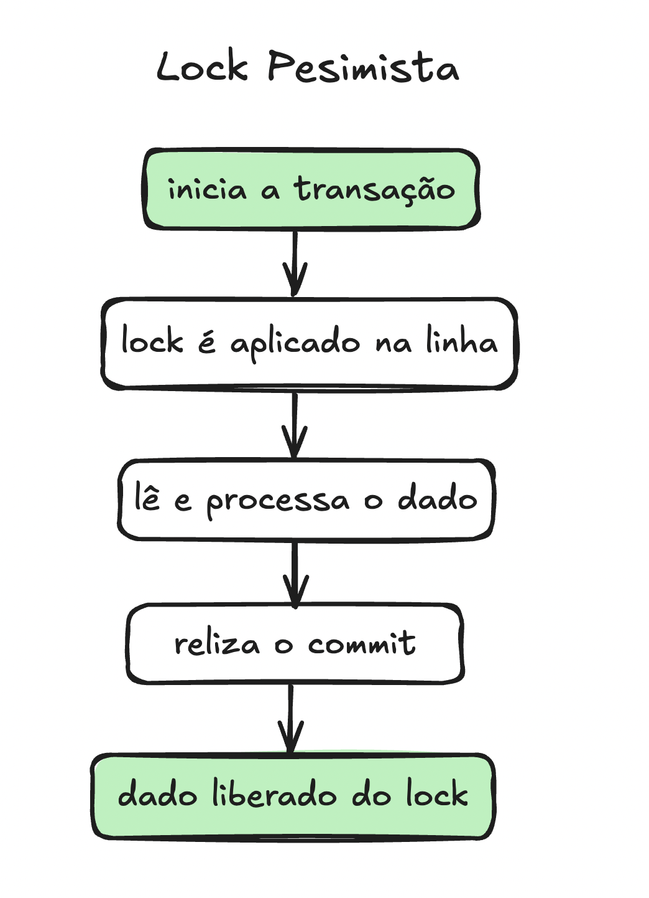


Partindo do pressuposto que concorrências acontecerão em uma aplicação multithread, nesse post vou descrever de forma simples e intuitiva o lock pessimista. Ele é um mecanismo de controle de acesso a recursos compartilhados, ou seja, quando threads simultâneas acessam o mesmo registro.  🚀


--- 


Importante entender também a estratégia de lock otimista e analisar qual se encaixa melhor no seu problema.


---

## Concorrência

Bom, imagina uma aplicação multithread, ou seja, o mesmo recurso pode ser acessado simultaneamente por threads diferentes.

Threads são processos em paralelo que estão rodando no seu programa e cada uma pode estar "disputando" o mesmo dado.

Trazendo pra vida real, é como se você, leitor, tivesse tentando reservar a cadeira E10 da sessão de Velozes e Furiosos do dia 16/11 às 19:00 e Bento, no mesmíssimo instante, está fazendo a mesma reserva, na mesma cadeira, na mesma sessão. Ou seja, vocês estão "disputando" o mesmo recurso do banco de dados. Está aí um clássico exemplo de concorrência.

Pra resolver esse caso temos várias alternativas e uma delas é o uso de Lock. 

## 🔒 O que é Lock Pessimista e Lock Otimista?

De maneira bastante resumida, um lock otimista assume que os conflitos são raros e o lock pessimista assume que os conflitos são comuns. 

Tá, mas o que isso significa? Signfica que as estratégias são diferentes para cada um. 

O Lock otimista verifica conflitos apenas na hora de atualizar o registro. Então, supondo que eu estou atualizando o registro de versão 2: se na hora de fazer o commit o lock vê que já existe a versão 3, significa que meu registro já não é o mais atual e a atualização para. 

Por exemplo, se você começou a editar com versão 2, mas outra transação já criou a versão 3, sua atualização será rejeitada (muito abstrato, eu sei, escrever sobre lock não está sendo fácil, mas no próximo artigo vamos aprofundar no lock otimista).


### Lock Pessimista

Aqui assumimos que os conflitos são comuns e por isso o lock pessimista "tranca" o registro. 

Podemos dizer que a tentativa de fazer a mesma reserva no cinema é comum, certo? Bom... então vamos implantar um lock pessimista nesse sistema. 

Isso significa que a partir de agora sempre que algum dado (a cadeira E10 da sessão de Velozes e Furiosos dia 16/11 as 19:00) estiver sendo disputado (por você e Bento) nós vamos trancar o acesso a essa linha do banco até que quem chegou primeiro finalize a operação que está tentando fazer.

A imagem abaixo mostra em alto nível como é realizado o lock.
Supondo que Bento começou a reserva primeiro, você só poderá fazer modificações (reservar) aquele assento quando Bento terminar ou desistir do processo dele. 



#### E em Java usando JPA ficaria assim:

```java
@Transactional
public void processarPedido(Long pedidoId) {
    // 1. A transação começa aqui. O pool de conexões nos empresta uma conexão.

    // 2. Pedimos o lock PESSIMISTIC_WRITE
    Pedido pedido = entityManager.find(
        Pedido.class,
        pedidoId,
        LockModeType.PESSIMISTIC_WRITE
    );

    // 3. O JPA traduz isso para SQL:
    // "SELECT * FROM pedidos WHERE id = ? FOR UPDATE"
    // O Banco de Dados AGORA bloqueia esta linha.

    // 4. NENHUMA outra transação pode escrever (ou ler com FOR UPDATE)
    // esta linha. Elas ficarão na fila, esperando.

    // ... fazemos nossa lógica de negócio ...
    pedido.setStatus("PROCESSADO");

    // 5. A transação faz COMMIT.
    // O lock é FINALMENTE liberado. A conexão é devolvida ao pool.
}
```


Importante notar aqui que o recurso mais escasso da sua aplicação não é CPU ou memória, é o pool de conexões do banco de dados. 
O lock pessimista segura essa conexão durante todo o tempo de vida da transação. Se a sua "lógica de negócio" for lenta (ex: chamar uma API externa), sua aplicação irá parar.
Por isso é importante trabalhar na arquitetura da sua aplicação e não deixar que a transação precise ficar esperando por respostas externas.


---

## Extras do JPA (o LockModeType)

LockModeType não é uma coisa só. A especificação JPA nos dá opções, e a escolha errada tem consequências.

### PESSIMISTIC_WRITE (O Lock Exclusivo)

- **SQL**: SELECT ... FOR UPDATE (na maioria dos dialetos).

- **O que faz**: Impede que outras transações façam SELECT ... FOR UPDATE E impede que façam UPDATE ou DELETE. É um lock exclusivo total.

- **Quando usar**: Este é o padrão. Você vai ler e definitivamente vai escrever na linha.

### PESSIMISTIC_READ (O Lock Compartilhado... às vezes)

- **SQL**: SELECT ... FOR SHARE (ex: PostgreSQL/MySQL 8+) ou ... LOCK IN SHARE MODE (MySQL antigo).

- **O que faz**: Impede que outras transações façam UPDATE ou DELETE, mas permite que outras transações também leiam com PESSIMISTIC_READ.

- **Quando usar**: Cenário mais raro. Você quer garantir que o dado não mude enquanto você lê, mas sabe que outros podem estar lendo ao mesmo tempo sem intenção de escrita.

### PESSIMISTIC_FORCE_INCREMENT (O Híbrido)

- **O que faz**: Adquire um lock pessimista (FOR UPDATE) e, além disso, força um incremento na coluna @Version (a mesma usada pelo lock otimista), mesmo que você não altere nenhum outro campo.

- **Quando usar**: Útil se você precisa invalidar caches ou "sinalizar" para sistemas otimistas que algo mudou, mas garantindo isso de forma pessimista.


## Dicas Extras:

1. Considere configurar timeout no seu lock

```java
Map<String, Object> properties = new HashMap<>();
// Define o timeout em milissegundos.
// "javax.persistence.lock.timeout" = 0 (não espere, falhe imediatamente)
// "javax.persistence.lock.timeout" = 5000 (espere 5 seg e lance LockTimeoutException)
properties.put("javax.persistence.lock.timeout", 5000);

Pedido pedido = entityManager.find(Pedido.class, id, LockModeType.PESSIMISTIC_WRITE, properties);
```

2. Se você optar pelo locking pessimista, sua transação deve ser cirúrgica. Ela deve ser extremamente rápida, não fazer I/O externo e ter um plano de tratamento para deadlocks (ordem de lock) e timeouts.


## Links úteis 🔗
- [Pessimistic Locking in JPA - Baeldung](https://www.baeldung.com/jpa-pessimistic-locking)
- [Controlling Concurrent Access to Entity Data with Locking](https://jakarta.ee/learn/docs/jakartaee-tutorial/current/persist/persistence-locking/persistence-locking.html)

